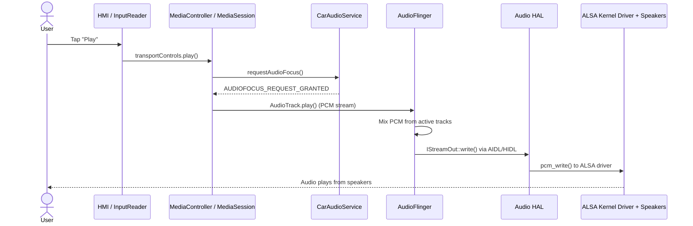

# Simulating Message Flow Between Media Service and Audio HAL in AAOS

A tiny Python simulation that shows what happens when you tap **Play** on an Android Automotive OS (AAOS) touchscreen, and how that tap travels down the stack until sound comes out of the speakers.

No Android build or emulator needed. The script just prints logcat-style logs that follow the real call chain.

## Sequence Diagram



## The 5 Layers

**1. HMI (Human-Machine Interface)**
The touchscreen and media app the driver sees. `InputReader` picks up the raw touch event and hands it to the media app, which turns it into a `play()` call.

**2. MediaSession**
The media app talks to the system through `MediaController` and `MediaSession`. It manages playback state (playing, paused, etc.) and kicks off audio playback.

**3. CarAudioService / AudioFlinger**
`CarAudioService` is the AAOS-specific part. It checks audio focus and decides if this app is allowed to play right now (for example, navigation prompts can duck the music). `AudioFlinger` then takes the PCM data from the app's `AudioTrack` and mixes it with other active streams.

**4. Audio HAL**
The Hardware Abstraction Layer. AudioFlinger calls `IStreamOut::write()` (over AIDL/HIDL) and the HAL translates that into calls the specific audio hardware understands.

**5. Kernel**
The ALSA Linux driver receives the PCM buffers and pushes them to the audio hardware (DSP/amplifier), which plays them through the car speakers.

## How to Run

Requires Python 3.6+. There are no dependencies to install.

```bash
git clone https://github.com/gparthiv/MODULE-6.git
cd MODULE-6
python simulate_flow.py
```

You'll see timestamped logs like:

```
09-29 14:32:01.123 D/InputReader: Touch event received at (540, 960) - ACTION_DOWN
```

## Files

| File | Purpose |
|------|---------|
| `README.md` | Docs and diagram |
| `simulate_flow.py` | Prints the simulated log trace |
| `requirements.txt` | Empty (stdlib only) |

